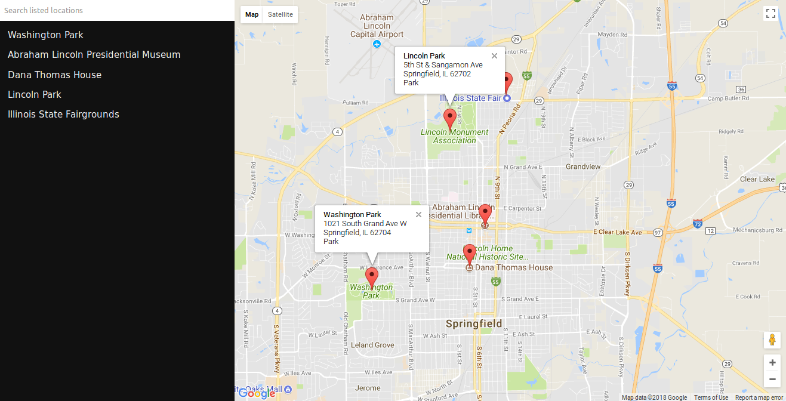

Neighborhood Map
====
This is part of Udacity Frontend Nanodegree, a single page application featuring a map of Springfield, IL.

Tools and Libraries
===
- [jQuery 3.3.1](https://jquery.com/)
- [Knockout JS 3.4.2](http://knockoutjs.com/index.html)
- [Google Maps API](https://developers.google.com/maps/documentation/javascript/)
- [Foursquare API](https://developer.foursquare.com/)
- [Surge](https://surge.sh/) for hosting

You can view the project live [here](http://cooperative-marble.surge.sh)

